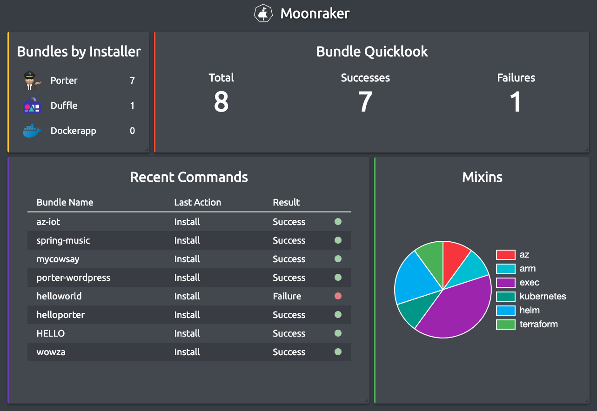

# Moonraker

## What is Moonraker?

Moonraker is a visualization tool for Cloud Native Application Bundles that watches the claims files produced by Porter, Duffle and Docker-App, and then aggregates the data provided into digestible metrics in the form of a dashboard.

## How do I use it?

### Prerequisites

- [NodeJS and NPM](https://nodejs.org/en/)

### Installation

1. Install Moonraker globally as an NPM package

        sudo npm i -g @moonraker/cli

2. Once installed, run the following command to see the options available:

        moonraker

3. In order to configure the dashboard to find claims, run the setup command

        moonraker setup

    The setup command performs the following steps:

    - Creates the `.moonraker` directory in the user's home directory, unless it already exists.
        - It will also create a `config.json` file in the new directory.

    - Clones the provided frontend dashboard into the `~/.moonraker/web` directory and builds it.

    Any configuration changes can be made by editing the `config.json` file.

4. Run Moonraker to see the dashboard.

        moonraker run

5. Navigate to `http://localhost:3002`.

---

## How do I customize Moonraker for my use cases?

### Running on a Different Port

To serve the dashboard on a different port, simply use:

    moonraker run -p [port]

replacing [port] with your desired port number.

### Watch Claims Stored in a Cloud Store

The API can leverage the same connection used by Porter's Azure storage plugin. 

To utilize that connection, first make sure you have followed the instructions at [https://porter.sh/plugins/azure](https://porter.sh/plugins/azure/) completely.

Once you have setup the plugin, all you have to do is run:

    moonraker run -r

### Watch Local Claims Stored Outside of Default Locations

By default, Moonraker looks for claims in the default locations for Porter, Duffle and DockerApp. If your claims are stored in a different location, or you are using a different installer, you can modify the mapping of the file locations found in `~/.moonraker/config.json`.

---

## Additional Features

### Using the API

For other visualization tools, you can consume claims in JSON format via `localhost:3002/claims`.

### Customizing the Dashboard Layout

Drag and drop the Moonraker dashboard tiles to customize the layout. To make a tile bigger or smaller, click on the bottom right corner of the tile and resize. To reset the dashboard layout, click on the settings icon in the upper right corner of the screen and click "Reset Dashboard". 